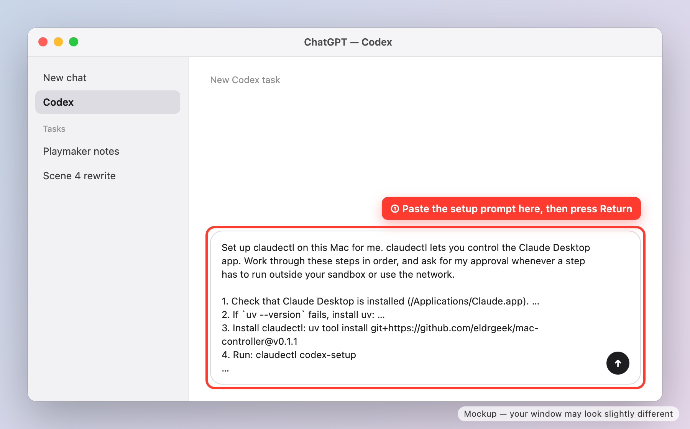
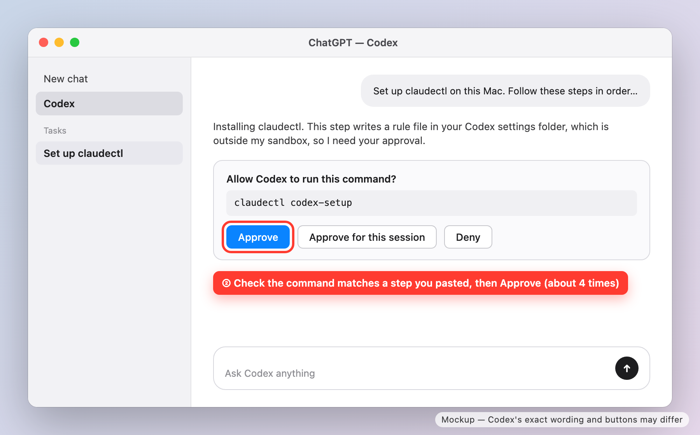
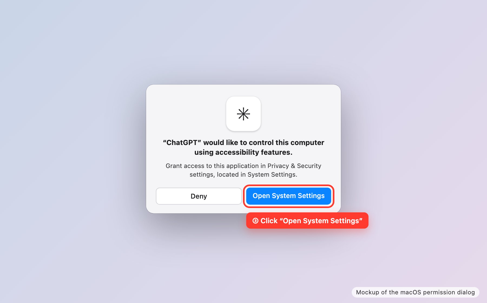
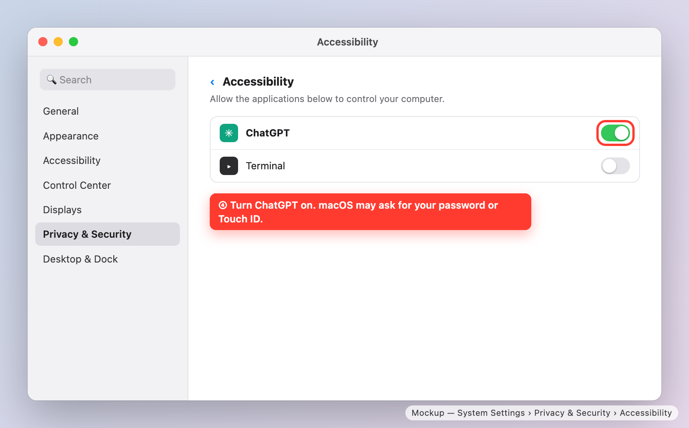
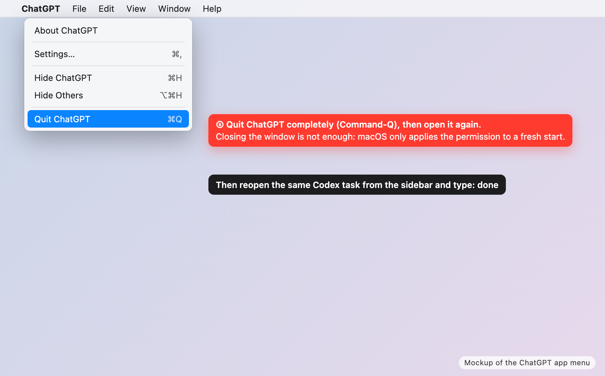
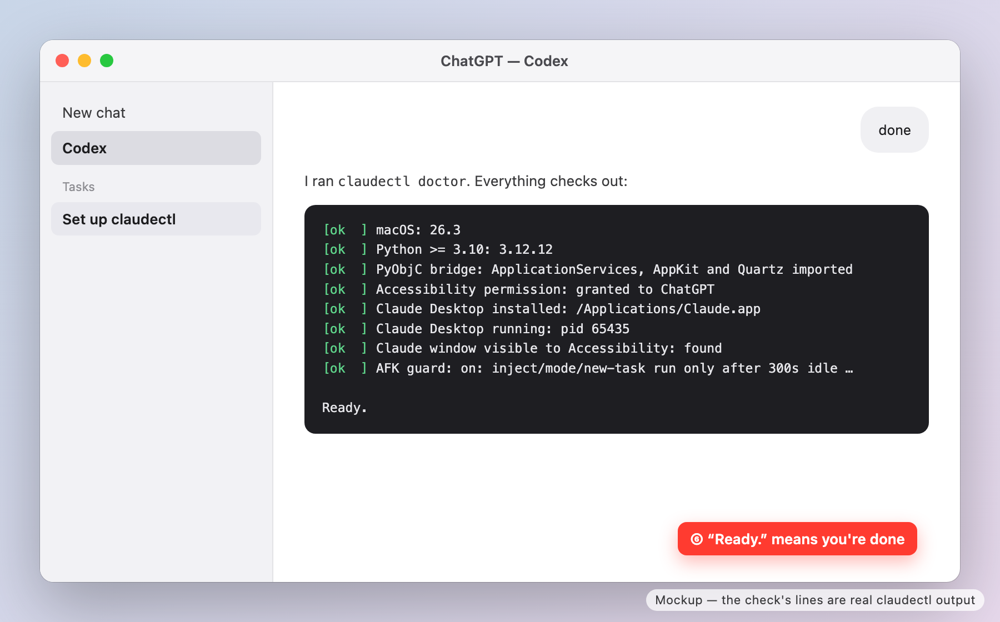

# Set up claudectl with Codex (ChatGPT app)

This guide is for someone who uses **Codex inside the ChatGPT app on a Mac**.
Codex does the installing. You do four small things: paste one message, approve a few steps, turn on one switch, and restart ChatGPT.
It takes about 10 minutes.

_Written 2026-09-16 by Claude Opus 5 for Mike Wolf, first for Eric Kohner. The pictures are mockups, so your screen may differ in small details._

## Before you start

- You need **Claude Desktop** on this Mac, signed in. `claudectl` controls that app. If you don't have it, install it from <https://claude.ai/download> first.
- You need the **ChatGPT app** with Codex.

## Why Codex needs your approval

Codex normally runs commands inside a sandbox, a protected space that cannot change your Mac.
`claudectl` has to work outside that sandbox, because it controls another app.
So Codex will stop and ask you before those steps. Approving them is expected.

---

## Step 1. Paste the setup message into Codex

Open the ChatGPT app, go to **Codex**, start a new task, and paste this whole message:

```text
Set up claudectl on this Mac for me. claudectl lets you control the Claude Desktop app. Work through these steps in order, and ask for my approval whenever a step has to run outside your sandbox or use the network.

1. Check that Claude Desktop is installed (/Applications/Claude.app). If it is not, stop and tell me to install it from https://claude.ai/download and sign in.
2. If `uv --version` fails, install uv: curl -LsSf https://astral.sh/uv/install.sh | sh
3. Install claudectl: uv tool install git+https://github.com/eldrgeek/mac-controller@v0.1.1
   If the `claudectl` command is not found afterwards, use ~/.local/bin/claudectl.
4. Run: claudectl codex-setup
5. Install the claudectl skill for Codex:
   mkdir -p ~/.codex/skills/claudectl && curl -fsSL https://raw.githubusercontent.com/eldrgeek/mac-controller/v0.1.1/skills/claudectl/SKILL.md -o ~/.codex/skills/claudectl/SKILL.md
6. Run `claudectl doctor` outside the sandbox. macOS will show me a dialog asking whether ChatGPT may control this computer. Tell me to click "Open System Settings", turn on ChatGPT, quit ChatGPT with Command-Q, reopen it, come back to this task, and type "done".
7. When I say done, run `claudectl doctor` again outside the sandbox and show me the result.
8. Ask me whether any scheduled job or other automation controls Claude Desktop on this Mac. If I say no, run `claudectl afk-guard off`.
```

Press Return.



## Step 2. Approve the setup steps

Codex asks before it downloads anything or writes outside its sandbox.
Expect about four requests. Read the command in each one; it should match a step in the message you pasted. Then click **Approve**.



## Step 3. Allow ChatGPT to control the Mac

When Codex runs the check in step 6 of the message, macOS shows this dialog.
Click **Open System Settings**.



If the dialog does not appear, open **System Settings**, click **Privacy & Security**, then click **Accessibility**.

## Step 4. Turn on the ChatGPT switch

In the Accessibility list, turn on **ChatGPT**.
macOS may ask for your password or Touch ID.



## Step 5. Quit and reopen ChatGPT

Choose **ChatGPT → Quit ChatGPT** (or press Command-Q), then open ChatGPT again.
Closing the window is not enough, because macOS only applies the new permission when the app starts fresh.
The restart also makes Codex load the rule that lets it run `claudectl` without asking each time.

Reopen the same Codex task from the sidebar and type **done**.



## Step 6. Check the result

Codex runs the check again. When every line says `ok` and the last line says **Ready.**, you're done.



Codex then asks one question: does any scheduled job or other automation control Claude Desktop on this Mac?
If you only ever run things yourself, answer **no**.
That turns off an idle check that would otherwise block commands while you're at the keyboard.

## Try it

Ask Codex:

> Use claudectl to open a new Cowork task in Claude Desktop and ask it to list the files on my Desktop.

## If something goes wrong

| What you see | What to do |
|---|---|
| A check line says `FAIL` for Accessibility | Turn on ChatGPT in System Settings → Privacy & Security → Accessibility, then quit ChatGPT with Command-Q and reopen it. |
| `running inside the Codex sandbox` | Codex ran the check inside its sandbox. Ask Codex to run it again outside the sandbox, and approve. |
| `Claude Desktop is not running` | Open Claude Desktop, then ask Codex to try again. |
| Codex keeps asking approval for every `claudectl` command | Quit ChatGPT with Command-Q and reopen it, so Codex loads the rule from `claudectl codex-setup`. |
| You use Codex in Terminal instead of the ChatGPT app | Everything is the same, except the switch to turn on in step 4 is **Terminal**. `claudectl doctor` names the right app. |

Anything else: send Mike the output of `claudectl doctor`, or open an issue at <https://github.com/eldrgeek/mac-controller/issues>.
